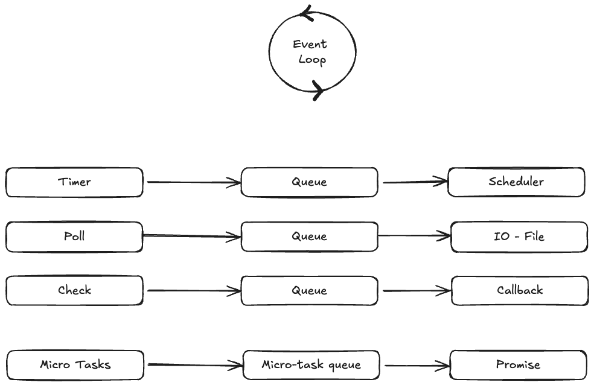

# Browser froms cratch

Creating browser from scratch to understand its internal working mechanism

## Milestones
- [x] Rendering engine
- [x] Event Loop

## How to run

### Run the rendering engine
```bash
$ cd rendering-engine
$ go mod tidy
$ go run .
# Output: browser.png
```

### Run the event loop
```bash
$ cd event-loop
$ go mod tidy
$ go run .
# Output: stdout
```

## Screenshots
### Rendering Engine


### Event Loop

