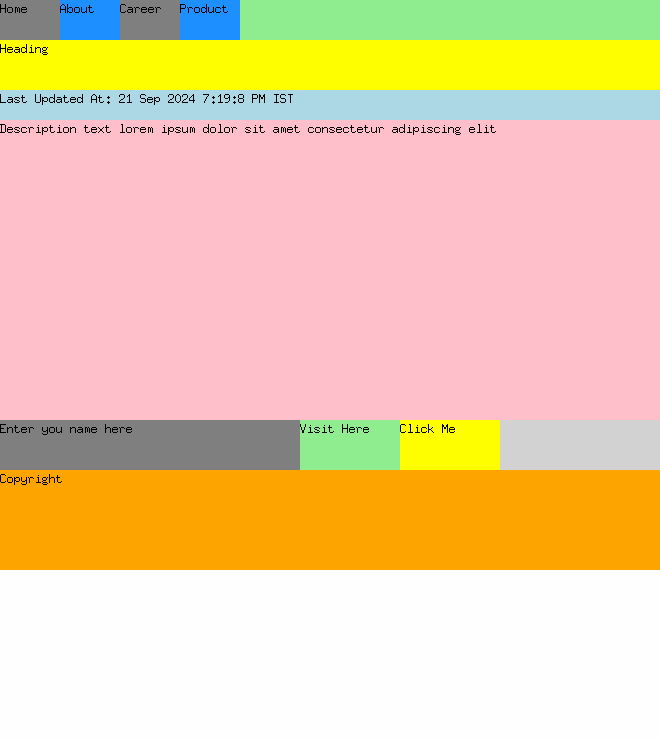

# Browser froms cratch

Creating browser from scratch to understand its internal working mechanism

## Milestones
- [ ] Rendering engine
- [ ] Event Loop
- [ ] Networking

## How to run
```bash
$ go mod tidy
$ go run .
```

## Screenshots

